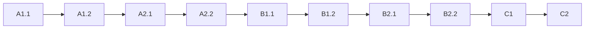

# 🇩🇪 Gateway to Future

> **Your Complete German Language Learning Journey from A1 to C2**

[](https://opensource.org/licenses/MIT)
[](https://www.coe.int/en/web/common-european-framework-reference-languages)
[](https://github.com/Gateway-To-Future/gateway-to-future)

## 📖 About

**Gateway to Future** is a comprehensive German language learning program specifically designed for Indian learners pursuing:
- 🎓 **Studienkolleg** (Foundation Year)
- 🔧 **Ausbildung** (Vocational Training)
- 🏛️ **University Admission**
- 💼 **Professional Career in Germany**

### Why This Course?

- ✅ **CEFR-Aligned**: Internationally recognized standards (A1-C2)
- ✅ **Exam-Oriented**: Prepares for Telc & Goethe-Institut certifications
- ✅ **Hindi Support**: Vocabulary and grammar explanations in Hindi (हिंदी)
- ✅ **Indian Context**: Relatable examples with Indian names and scenarios
- ✅ **Premium Quality**: Professional textbook-grade content
- ✅ **Comprehensive**: Complete coverage from beginner to advanced

## 📚 Course Structure

### Available Levels

#### 🟢 A1 Level (Beginner)
- **A1.1**: Your First Step to Germany *(71 pages, Completed ✓)*
  - 15 Chapters covering greetings, family, food, shopping, transport, daily routine
  - Full vocabulary tables with German-English-Hindi translations
  - Mini dialogues with Indian character names (Raj, Priya, Arjun, Anna)
  - Practice exercises with answer keys
  - Mock exam (Telc & Goethe A1 format)

- **A1.2**: Building Your Foundation *(In Development)*

#### 🟡 A2 Level (Elementary)
*Coming Soon*

#### 🟠 B1-B2 Levels (Intermediate)
*Planned*

#### 🔴 C1-C2 Levels (Advanced)
*Planned*

## 📥 Downloads

### Current Release

- **A1.1 - Your First Step to Germany** 
  - [Download PDF](./books/A1.1-Your-First-Step-to-Germany.pdf)
  - Format: PDF, 71 pages
  - Language: German with English/Hindi support
  - Price: Free (Educational Resource)

## 🎯 Learning Path



## 📋 A1.1 Table of Contents

### Module 1: Erste Schritte (First Steps)
1. **Hallo, ich bin!** - Greetings & Introductions
2. **Woher kommst du?** - Countries, Nationalities & Languages
3. **Das Alphabet** - German Alphabet & Pronunciation

### Module 2: Mein Leben (My Life)
4. **Familie und Freunde** - Family & Friends
5. **Zahlen, Datum, Uhrzeit** - Numbers, Dates & Time
6. **Mein Zuhause** - My Home

### Module 3: Alltag in Deutschland (Daily Life)
7. **Essen und Trinken** - Food & Drinks
8. **Einkaufen** - Shopping
9. **Verkehrsmittel** - Transport

### Module 4: Arbeit und Studium (Work & Study)
10. **Berufe und Träume** - Jobs & Dreams
11. **Im Kurs** - In the Class
12. **Mein Alltag** - My Daily Routine

### Module 5: Prüfungsvorbereitung (Exam Preparation)
13. **Lesen und Schreiben A1** - Reading & Writing
14. **Hören und Sprechen A1** - Listening & Speaking
15. **Mock Exam** - Telc & Goethe A1 Practice Test

## 🛠️ Project Structure

```
gateway-to-future/
│
├── books/                  # Published textbooks (PDF)
│   ├── A1.1-Your-First-Step-to-Germany.pdf
│   └── ...
│
├── content/               # Source content
│   ├── A1/
│   ├── A2/
│   └── ...
│
├── scripts/               # Automation scripts
│   ├── Start-GatewayWorkspace.ps1
│   └── ...
│
├── app/                   # Web/mobile application
│   └── ...
│
└── ai-workflows/          # AI generation workflows
    └── ...
```

## 🚀 Getting Started

### For Learners

1. **Choose Your Level**: Start with A1.1 if you're a complete beginner
2. **Download the Book**: Get the PDF from the Downloads section
3. **Study Systematically**: Follow the chapters in order
4. **Practice Daily**: 15-20 minutes daily is better than long weekly sessions
5. **Take Mock Exams**: Use Chapter 15 to test your readiness

### For Contributors

```powershell
# Clone the repository
git clone https://github.com/Gateway-To-Future/gateway-to-future.git
cd gateway-to-future

# Run the workspace setup (PowerShell)
.\scripts\Start-GatewayWorkspace.ps1
```

## 🎓 Certification Path

| Level | Exam | Description |
|-------|------|-------------|
| A1 | Telc Deutsch A1 / Goethe-Zertifikat A1 | Basic user - Can introduce themselves and answer simple questions |
| A2 | Telc Deutsch A2 / Goethe-Zertifikat A2 | Elementary - Can handle routine tasks requiring simple exchanges |
| B1 | Telc Deutsch B1 / Goethe-Zertifikat B1 | Intermediate - Can deal with most situations while traveling |
| B2 | Telc Deutsch B2 / Goethe-Zertifikat B2 | Upper Intermediate - Can interact fluently with native speakers |
| C1 | Telc Deutsch C1 / Goethe-Zertifikat C1 | Advanced - Can express ideas fluently and spontaneously |
| C2 | Telc Deutsch C2 / Goethe-Zertifikat C2 | Proficient - Near-native level mastery |

## 💰 Pricing

- **A1.1 Book**: FREE (Open Educational Resource)
- **Future Levels**: Planned at €11.11 per level
- **Complete A1-C2 Bundle**: Special pricing TBA

## 🤝 Contributing

We welcome contributions! Whether you're:
- 📝 Improving content
- 🐛 Reporting issues
- 🌐 Adding translations
- 💡 Suggesting features

Please feel free to open an issue or submit a pull request.

## 📞 Support

- **Issues**: [GitHub Issues](https://github.com/Gateway-To-Future/gateway-to-future/issues)
- **Email**: [Contact Us](mailto:contact@gateway-to-future.com)
- **Community**: Join our learner community

## 📜 License

This project is licensed under the MIT License - see the [LICENSE](LICENSE) file for details.

## 🙏 Acknowledgments

- CEFR Framework by Council of Europe
- Telc GmbH for examination standards
- Goethe-Institut for German language promotion
- Indian learner community for feedback and support

---

**Made with ❤️ for Indian learners pursuing their German dream**

*Dein Tor zur Zukunft beginnt hier. (Your gateway to the future starts here.)*
